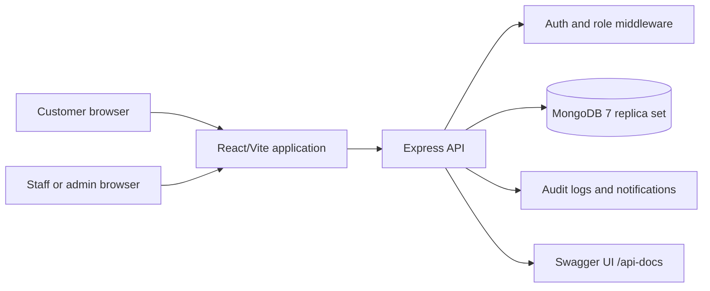

# Support Ops Desk

Support Ops Desk is an internal-style service ticket management application for customers, support staff, and administrators. Its primary responsibility is to manage ticket intake, assignment, customer communication, lifecycle tracking, audit history, and recoverable deletion on a React, Express, and MongoDB stack.

## Quick Start

### Prerequisites

- Node.js `>= 22.x` for local development. The production Docker image uses Node.js `24`.
- npm compatible with the selected Node.js installation.
- MongoDB `7.x` or newer for local development, or Docker Desktop with Compose v2.
- A modern browser: Chrome, Edge, Safari, or Firefox.
- Repository access and permission to run local containers on the development machine.
- No corporate VPN, IAM role, cloud account, or Kubernetes CLI is required by the current repository configuration. Production network and database access must be supplied by the deployment owner.

### Setup Instructions

1. **Clone the repository:**

   ```bash
   git clone https://github.com/Ash12106/Support-Desk-Final.git
   cd Internship-main
   ```

2. **Configure the local environment:**

   ```bash
   cp .env.example .env
   ```

   Set local values in `.env`. Do not commit `.env` or credentials.

3. **Install dependencies:**

   ```bash
   npm install
   ```

4. **Start MongoDB** locally or use the Docker workflow below.

5. **Start the development server:**

   ```bash
   npm run dev
   ```

6. **Verify the application:**

   - Staff/admin login: `http://localhost:3000/login`
   - Customer login and registration: `http://localhost:3000/customer/login`
   - Database readiness: `http://localhost:3000/api/health/db`
   - API documentation: `http://localhost:3000/api-docs`

The health endpoint should return HTTP `200` with a connected MongoDB response.

### Docker quick start

Docker Compose runs the production build, MongoDB 7, and the single-node replica-set initializer:

```bash
docker compose up --build -d
docker compose ps
curl http://localhost:3000/api/health/db
```

Expected state:

- `app` is running and publishes port `3000`.
- `mongo` is running and reports `healthy`.
- `mongo-init` completes successfully once during startup.
- `/api/health/db` reports a connected database.

Stop the stack while preserving data:

```bash
docker compose down
```

Delete the database volume only when intentionally resetting all local data:

```bash
docker compose down -v
```

## Architecture & Stack

### System overview



### Core modules

- **Frontend:** `src/` contains React routes, layouts, ticket forms, dashboards, profile views, customer portal views, and shared UI components.
- **API client:** `src/api/index.ts` centralizes browser requests and response handling.
- **Server:** `server/index.ts` serves the API and compiled frontend, registers middleware, exposes Swagger, and performs startup migrations.
- **Persistence:** `server/mongo.ts` defines MongoDB connection handling, schemas, migrations, and transactional operations.
- **Notifications:** `server/notifications.ts` manages customer notification records.
- **Status logic:** `server/status.ts` centralizes ticket lifecycle and activity-state behavior.
- **Tests:** `server/*.test.ts` covers API, notifications, and status behavior; `src/routes/TicketsDashboard.test.tsx` covers dashboard behavior.
- **Deployment:** `Dockerfile` creates the frontend/server production image; `docker-compose.yml` supplies the app, MongoDB, replica-set initialization, and persistent volume.

### Primary business flows

- Customer registration, login, ticket creation, status tracking, notifications, comments, and profile updates.
- Staff assignment, ticket search/filtering, lifecycle updates, activity-state updates, comments, attachments, and availability.
- Administrator user management, role/team/branch updates, availability-aware assignment, bulk assignment, reporting, and deleted-ticket restoration.
- Ticket lifecycle states: `Open`, `In Progress`, `Resolved`, `Closed`.
- Activity states: `Unread`, `Read`, `Awaiting customer response`, `Awaiting technician response`.

## Configuration Variables

Copy `.env.example` to `.env` for local use. Values below are examples only; production secrets must come from the deployment secret-management process.

| Variable                | Description                                             | Default / Example                       | Required                   |
| ----------------------- | ------------------------------------------------------- | --------------------------------------- | -------------------------- |
| `MONGO_URI`             | Preferred MongoDB connection string                     | `mongodb://localhost:27017/support-ops` | Yes                        |
| `MONGODB_URI`           | Backwards-compatible MongoDB variable                   | Empty                                   | No                         |
| `PORT`                  | HTTP port exposed by the Node server                    | `3000`                                  | No                         |
| `CORS_ORIGIN`           | Exact allowed browser origin                            | `http://localhost:3000`                 | Yes for shared/prod use    |
| `ADMIN_PASSWORD`        | Password for the migration-created admin account        | `admin@2026` locally                    | Yes; change before sharing |
| `GOOGLE_CLIENT_ID`      | Backend Google ID-token verification client ID          | Empty                                   | No                         |
| `VITE_GOOGLE_CLIENT_ID` | Frontend Google OAuth client ID; embedded at build time | Empty                                   | No                         |
| `NODE_ENV`              | Runtime mode used by the server                         | `development` or `production`           | No                         |

Google sign-in requires the same web OAuth client ID in both Google variables and an exact origin registration in Google Cloud Console. Rebuild Docker after changing `VITE_GOOGLE_CLIENT_ID`.

## Testing & Code Quality

Run all checks before opening a pull request or handing off a build:

```bash
# TypeScript type check
npm run lint

# ESLint
npm run lint:eslint

# Unit and API test suite
npm test

# Formatting validation
npm run format:check

# Production frontend and server build
npm run build

# Dependency advisory review
npm audit
```

Current repository test coverage includes four Vitest files and 31 passing tests in the verified local run. The production build completes successfully. Vite may report a non-blocking warning when the main browser bundle exceeds 500 kB; optimize later with route-level dynamic imports and Rollup chunk configuration.

### Live smoke checks

After starting Docker, run:

```bash
docker compose ps
curl -fsS http://localhost:3000/api/health/db
curl -sS -o /dev/null -w '%{http_code}\n' http://localhost:3000/api/tickets
```

Expected results are a healthy MongoDB service, a successful health response, and HTTP `401` for the protected ticket route without a bearer token. A repeated health loop is useful for detecting startup instability:

```bash
for i in {1..100}; do curl -fsS http://localhost:3000/api/health/db >/dev/null; done
```

## API and Operational Endpoints

Protected endpoints currently use the development authentication header `Authorization: Bearer <user-id>`.

- `GET /api/health/db`: MongoDB connectivity and readiness.
- `GET /api-docs`: Swagger UI.
- `POST /api/auth/login`: staff/admin login.
- `POST /api/customer-auth/register`: customer registration.
- `GET /api/tickets`: staff/admin ticket list with search, filters, pagination, and sorting.
- `GET /api/tickets/stats`: dashboard metrics.
- `POST /api/tickets`: staff/admin ticket creation.
- `GET /api/tickets/:id`: ticket, comments, audit log, assignment, and attachments.
- `PUT /api/tickets/:id`: ticket updates subject to role and assignment rules.
- `DELETE /api/tickets/:id`: archive a ticket into `deleted_tickets`.
- `GET /api/admin/deleted-tickets`: administrator archive listing.
- `POST /api/admin/deleted-tickets/:id/restore`: administrator ticket restore.
- `GET /api/customer/tickets`: authenticated customer ticket list.
- `POST /api/customer/tickets`: authenticated customer ticket creation.
- `GET /api/customer/notifications`: authenticated customer notifications.

See `/api-docs` and `SUPPORT_DESK_GUIDE.md` for the complete route and workflow reference.

## Deployment & CI/CD Pipeline

### Current deployment path

There is no `.github/workflows` CI/CD pipeline in the current repository. Deployment is currently a manual, Docker Compose-based flow:

1. Run the quality checks listed above.
2. Build and start the production stack:

   ```bash
   docker compose up --build -d
   ```

3. Verify containers and database readiness:

   ```bash
   docker compose ps
   curl -fsS http://localhost:3000/api/health/db
   ```

4. Place HTTPS and a reverse proxy or managed hosting layer in front of the Node server before public exposure.
5. Set `CORS_ORIGIN` to the exact public origin and provide `MONGO_URI` through the deployment secret manager.

### Image and runtime details

- Build stage: Node.js 24 Alpine, dependency install, Vite frontend build, and esbuild server bundle.
- Runtime stage: Node.js 24 Alpine with production dependencies and `dist/server.cjs`.
- Database: MongoDB 7 with a single-node replica set and persistent `mongo_data` volume.
- Build-time frontend configuration: `VITE_GOOGLE_CLIENT_ID`.
- Runtime configuration: `MONGO_URI`, `PORT`, `CORS_ORIGIN`, `GOOGLE_CLIENT_ID`, and `NODE_ENV`.

If this application is adopted by an enterprise team, add a protected CI workflow for install, lint, test, build, dependency scanning, image scanning, and deployment promotion. Keep credentials in the organization's secret manager rather than GitHub files.

## Ownership & Support

The repository does not currently define an engineering team, Slack/Teams channel, tech lead, or on-call rotation. Complete these values before internal operational handoff:

- **Engineering Team:** `[Team or squad name]`
- **Slack / Teams Channel:** `[#support-ops-channel]`
- **Tech Lead / Primary Maintainer:** `[@maintainer]`
- **Incident / Escalation Path:** `[Pager, ticket queue, or service owner]`
- **Production URL:** `[Add after deployment]`
- **Architecture decisions:** `[Link to internal ADR or wiki]`

For detailed role workflows, troubleshooting, rollback behavior, and screenshot evidence, see [SUPPORT_DESK_GUIDE.md](SUPPORT_DESK_GUIDE.md).

## Security Notes

- Never commit `.env`, OAuth client secrets, database credentials, or bearer tokens.
- Set a strong `ADMIN_PASSWORD` before using shared data.
- Use HTTPS and secure server-managed sessions or signed short-lived tokens before public production use; the current browser-stored user ID bearer-token model is for development.
- Configure a restricted `CORS_ORIGIN` in shared environments.
- Review `npm audit --omit=dev` before release. The current repository documentation records two moderate `qs` advisories inherited through Express 4.
- Redact request and database details when replacing startup logs with structured production logging.
