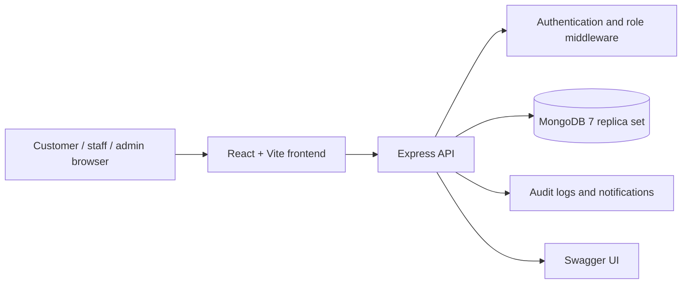
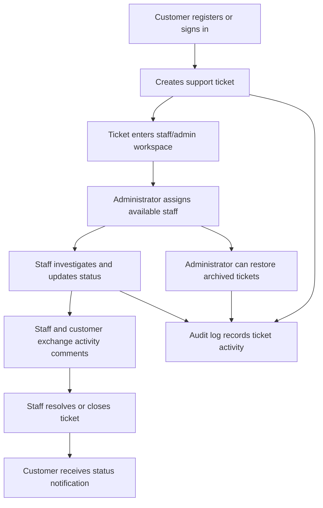

# Support Ops Desk

Support Ops Desk is an internal service-ticket management application used by customers, support staff, and administrators. It manages ticket intake, assignment, customer communication, lifecycle tracking, audit history, notifications, attachments, and recoverable deletion on a React, Express, and MongoDB stack.

**Author:** Aashish A. Shirahatti, 3rd-year CSE-AIML student at VVCE, Mysore.

**Live demo:** `https://render-desk.onrender.com`<br>
**Tried to add google Auth but has issues use these for testing:** `Username:admin,password:admin@2026`,`Staff:Aashish6782,password:Asdf0987`,`Customer:Uthi27,password:Asdf1234`<br>
**You can add new Staff from the admin login and then use the same credentionals to log on to staff Account**
**You can add new Customers from create account option on signin page** 
**Demo health check:** `https://render-desk.onrender.com/api/health/db`

## 1.README

### Prerequisites

- Node.js `>= 22.x` for local development. The production image uses Node.js `24`.
- npm compatible with the selected Node.js version.
- MongoDB `7.x` or Docker Desktop with Compose v2.
- Modern browser: Chrome, Edge, Safari, or Firefox.
- Repository access and local permission to run Docker containers.
- No corporate VPN, IAM role, Kubernetes CLI, or cloud credential is required by the current repository. Production access must be supplied by the deployment owner.

### Local setup

```bash
git clone https://github.com/Ash12106/Support-Desk-Final.git
cd Render-desk
cp .env.example .env
npm install
npm run dev
```

Start MongoDB locally before `npm run dev`, or use the Docker setup:

```bash
docker compose up --build -d
docker compose ps
curl -fsS http://localhost:3000/api/health/db
```

Expected local URLs:

- Staff/admin login: `http://localhost:3000/`
- Customer login and registration: `http://localhost:3000/customer/login`
- Database readiness: `http://localhost:3000/api/health/db`
- Swagger UI: `http://localhost:3000/api-docs`

### Interviewer quick test

```bash
# Start the complete local stack
docker compose up --build -d

# Confirm containers and database readiness
docker compose ps
curl -fsS http://localhost:3000/api/health/db

# Generate sample customers, tickets, audit logs, and comments
npm run seed
```

Then open `http://localhost:3000/` and use the admin account configured by
`ADMIN_PASSWORD` (default local value: `admin` / `admin@2026`). From the admin
workspace, create a staff account and assign a generated ticket. Open
`http://localhost:3000/customer/login` in a private window to register a
customer, create a ticket, and test the shared activity flow.

The seed command creates customer profiles and ticket data; it does not create
customer login accounts. Customer accounts must be registered through the
customer login screen or API.

### Environment variables

Copy `.env.example` to `.env`. Use placeholders or a secret manager for shared environments; never commit real credentials.

| Variable                | Description                                       | Example                                 | Required                     |
| ----------------------- | ------------------------------------------------- | --------------------------------------- | ---------------------------- |
| `MONGO_URI`             | Preferred MongoDB connection string               | `mongodb://localhost:27017/support-ops` | Yes for local Node execution |
| `MONGODB_URI`           | Backwards-compatible MongoDB variable             | Empty                                   | No                           |
| `PORT`                  | HTTP port                                         | `3000`                                  | No                           |
| `CORS_ORIGIN`           | Allowed browser origin                            | `http://localhost:3000`                 | Yes for shared/prod use      |
| `ADMIN_PASSWORD`        | Startup-created admin password                    | `change-me-locally`                     | Yes; change before sharing   |
| `GOOGLE_CLIENT_ID`      | Backend Google ID-token audience                  | Empty                                   | No                           |
| `VITE_GOOGLE_CLIENT_ID` | Frontend Google OAuth client ID; build-time value | Empty                                   | No                           |
| `NODE_ENV`              | Runtime mode                                      | `development` or `production`           | No                           |

For local Google sign-in, use the same Google OAuth client ID for `GOOGLE_CLIENT_ID` and
`VITE_GOOGLE_CLIENT_ID`. In Google Cloud Console, add `http://localhost:3000` under
**Authorized JavaScript origins** for that client. Staff and admin accounts must already
exist with the same Google account email; customer Google sign-in can create or link a
customer account automatically.

### Architecture overview



Core modules:

- `src/`: React routes, dashboards, customer portal, ticket forms, profiles, and shared UI.
- `src/api/index.ts`: browser API client.
- `server/index.ts`: Express API, middleware, Swagger, static frontend serving, and startup migrations.
- `server/mongo.ts`: MongoDB connection, schemas, migrations, and transactions.
- `server/notifications.ts`: customer notification records.
- `server/status.ts`: lifecycle transition rules.
- `server/*.test.ts` and `src/routes/TicketsDashboard.test.tsx`: API, notification, status, and dashboard tests.
- `Dockerfile` and `docker-compose.yml`: production image and MongoDB replica-set deployment.

### Application features by stakeholder

| Stakeholder               | Main features                                                                                                                                                                              | Value delivered                                                                     |
| ------------------------- | ------------------------------------------------------------------------------------------------------------------------------------------------------------------------------------------ | ----------------------------------------------------------------------------------- |
| **Customer**              | Register and sign in, create support tickets, view ticket status, read notifications, exchange comments, manage profile, and use Google sign-in when configured.                           | A self-service support channel with transparent progress and conversation history.  |
| **Support staff**         | View assigned work, search and filter tickets, update lifecycle and activity status, comment, inspect customer context, download attachments, and publish availability.                    | A focused workspace for resolving assigned requests and keeping customers informed. |
| **Administrator**         | Create staff/admin accounts, manage roles, teams, branches and profile details, review workload metrics, assign tickets to available staff, bulk-assign work, and restore deleted tickets. | Operational control, workload balancing, and recoverability.                        |
| **Application/API**       | Role-based authorization, Zod validation, rate limiting, Helmet security headers, transactional writes, audit logs, notifications, health checks, and Swagger documentation.               | Consistent, observable, and safer service behavior.                                 |
| **Developer/Interviewer** | Docker Compose startup, database seed script, automated tests, formatting/lint checks, health endpoint, API documentation, and repeatable smoke-test commands.                             | Fast reproduction and easy technical evaluation.                                    |

### End-to-end stakeholder flow



### Feature demonstration order

1. Start Docker and run `npm run seed` to populate tickets, customers, comments, and audit records.
2. Sign in as the default administrator and create a staff account.
3. Assign a generated ticket to the staff member and update its lifecycle.
4. Register a customer in a private browser window and create a customer ticket.
5. Exchange comments between customer and staff and verify the activity log.
6. Close a ticket, verify it becomes read-only, then test administrator deletion and restoration.

### Testing and quality checks

Run these commands before a pull request:

```bash
npm run lint
npm run lint:eslint
npm run format:check
npm test
npm run build
npm audit
```

The verified local suite contains 4 Vitest files and 31 passing tests. The build may emit a non-blocking Vite warning when the main browser bundle exceeds 500 kB.

### Deployment and CI/CD

The repository currently has no `.github/workflows` CI/CD pipeline. The supported deployment path is a manual Docker Compose release:

```bash
npm run lint
npm run lint:eslint
npm run format:check
npm test
npm run build
docker compose up --build -d
docker compose ps
curl -fsS http://localhost:3000/api/health/db
```

The Docker image builds the frontend and bundled server with Node.js 24 Alpine. The runtime serves `dist/server.cjs` on port `3000`. MongoDB 7 runs as a single-node replica set with the persistent `mongo_data` volume. Before public exposure, add HTTPS, a reverse proxy or managed platform, restricted `CORS_ORIGIN`, and deployment-secret injection.

### Render deployment

- **Render application URL:** `https://render-desk.onrender.com`
- **Health endpoint:** `https://render-desk.onrender.com/api/health/db`
- **Swagger URL:** `https://render-desk.onrender.com/api-docs`
- **Render service name:** `support-ops-desk`

Required Render variables are `MONGO_URI`, `PORT`, `CORS_ORIGIN`,
`ADMIN_PASSWORD`, `GOOGLE_CLIENT_ID`, and
`NODE_ENV=production`. Use `https://render-desk.onrender.com` as the production
`CORS_ORIGIN`. Keep database credentials and OAuth values in Render's environment
settings, not in this file.

`GOOGLE_CLIENT_ID` is read by the server at runtime. The frontend reads the
public client ID from `/api/auth/config`, so Docker does not need a
`VITE_GOOGLE_CLIENT_ID` build argument. Keeping `VITE_GOOGLE_CLIENT_ID` set is
still supported for local or static frontend builds.

For Google sign-in, add both `http://localhost:3000` and
`https://render-desk.onrender.com` under the OAuth client's **Authorized JavaScript
origins** in Google Cloud Console. `GOOGLE_CLIENT_ID` and
`VITE_GOOGLE_CLIENT_ID` must contain the same client ID. The production server
allows Google Identity Services through its Content Security Policy.

### Final submission edit checklist

Before sharing this README with the interviewer, update only these marked values:

1. Replace `[team or squad]`, `[#support-ops-channel]`, `[@maintainer]`, and `[pager, ticket queue, or service owner]` in Ownership and support.
2. Do not replace placeholder passwords with real secrets; keep credentials in Render environment settings.

### Ownership and support

The repository does not currently define formal ownership or an on-call rotation. Complete these values for internal handoff:

- **Engineering team:** `[team or squad]`
- **Support channel:** `[#support-ops-channel]`
- **Primary maintainer:** `[@maintainer]`
- **Incident escalation:** `[pager, ticket queue, or service owner]`
- **Production URL:** `https://render-desk.onrender.com`

---

## 2. Architecture Decision Record: MongoDB Replica Set

- **Status:** Accepted for the current application
- **Date:** 2026-09-09
- **Decision owner:** Support Ops Desk engineering owner

### Context

The application creates related records across users, customers, tickets, comments, notifications, audit logs, and the deleted-ticket archive. Registration, ticket creation, deletion, and restoration require atomic multi-document writes. A standalone MongoDB process does not provide the transaction topology required by these workflows, while the application must remain simple to run locally and in Docker.

### Decision

Use MongoDB 7 configured as a single-node replica set for local and Compose-based deployments. Mongoose provides schema and connection management, while the application uses transactions for multi-document operations. Docker Compose starts MongoDB with `--replSet rs0` and runs a one-shot initializer before the app container starts.

### Rationale

- Supports the existing transactional write model without introducing a second database system.
- Preserves a simple document model for tickets, comments, audit records, notifications, and customer profiles.
- Matches MongoDB Atlas replica-set behavior closely enough for development and integration testing.
- Keeps local onboarding reproducible with one Compose command.

### Consequences

**Benefits**

- Atomic registration, ticket, archive, and restore workflows.
- Natural document representation for variable ticket fields and attachments.
- Persistent local data through the `mongo_data` Docker volume.
- Clear health and initialization checks.

**Costs and risks**

- Local MongoDB setup is more complex than a standalone process.
- A single-node replica set is not high availability; production must use an appropriately sized managed or clustered deployment.
- Transaction behavior depends on correct session handling and replica-set readiness.
- MongoDB connection, storage, and transaction metrics require operational monitoring.

**Revisit when:** production scale, multi-region recovery, reporting workloads, or retention requirements exceed the current single-node/document-store design.

---

## 3. API Contract Overview: Customer Registration

### Endpoint

`POST /api/customer-auth/register`

Creates a customer profile and customer user account in one MongoDB transaction.

### Authentication

Public endpoint. No bearer token is required.

### Request headers

```http
Content-Type: application/json
```

### Request payload

```json
{
  "name": "Asha Patel",
  "email": "asha.patel@example.com",
  "username": "asha.patel",
  "password": "replace-with-a-local-password"
}
```

Validation rules:

- `name`: trimmed string, minimum 2 characters.
- `email`: valid email address; stored in lowercase.
- `username`: trimmed string, 3 to 40 characters.
- `password`: minimum 8 characters; stored only as a bcrypt hash.

### Success response: `201 Created`

The response contains the newly created user document. The exact MongoDB-generated `_id` values can vary by environment; sensitive password material is not returned.

```json
{
  "_id": "65f000000000000000000001",
  "username": "asha.patel",
  "role": "customer",
  "customerId": "65f000000000000000000002"
}
```

### Error responses

| Status | Condition                        | Response shape                                                                                        |
| ------ | -------------------------------- | ----------------------------------------------------------------------------------------------------- |
| `400`  | Invalid payload                  | `{ "success": false, "message": "Validation failed", "fields": {}, "data": null }`                    |
| `409`  | Username or email already exists | `{ "success": false, "message": "...", "data": null }`                                                |
| `503`  | MongoDB unavailable              | `{ "success": false, "message": "Service temporarily unavailable (database offline)", "data": null }` |
| `500`  | Unexpected server failure        | `{ "success": false, "message": "Unexpected server failure", "data": null }`                          |

### Example

```bash
curl -X POST http://localhost:3000/api/customer-auth/register \
  -H 'Content-Type: application/json' \
  -d '{
    "name": "Asha Patel",
    "email": "asha.patel@example.com",
    "username": "asha.patel",
    "password": "local-password-123"
  }'
```

---

## 4. Developer Onboarding and Troubleshooting Guide

### First-day checklist

1. Install Node.js 22+ and Docker Desktop with Compose v2.
2. Clone the repository and copy `.env.example` to `.env`.
3. Start the stack with `docker compose up --build -d`.
4. Verify `docker compose ps` and `/api/health/db`.
5. Run `npm test`, `npm run lint`, and `npm run lint:eslint`.
6. Review `SUPPORT_DESK_GUIDE.md` and `/api-docs`.

### Generate local mock data

The seed command creates up to 12 customer profiles, up to 50 tickets, audit
records for generated tickets, and comments for the first 10 generated tickets.
It does not delete existing data, skips ticket generation when 50 tickets
already exist, and does not create customer login accounts.

```bash
npm run seed
```

For a clean Docker database reset, use this only when existing local data can be discarded:

```bash
docker compose down -v
docker compose up --build -d
npm run seed
```

### Common setup errors

#### Error 1: `npm ci` reports a lockfile mismatch or an unsupported Node engine

**Cause:** The dependency lockfile and `package.json` are not synchronized, or Node.js is below the supported version.

**Resolution:**

```bash
node --version
npm --version
npm install
npm run lint
```

Use Node.js 22 or newer. Docker uses Node.js 24 and installs from the committed lockfile.

#### Error 2: `mongo-init` exits or the app reports database unavailable

**Cause:** MongoDB has not finished starting, the replica set was not initialized, or an old Docker volume contains an invalid local state.

**Resolution:**

```bash
docker compose ps -a
docker compose logs mongo mongo-init
docker compose down -v
docker compose up --build -d
curl -fsS http://localhost:3000/api/health/db
```

The `-v` flag deletes local database data; do not use it for shared or valuable environments.

### Git workflow standard

The repository does not currently enforce a branch or commit policy in CI. The following convention is recommended for pull requests:

- Branches: `feature/<short-description>`, `fix/<short-description>`, `docs/<short-description>`, `chore/<short-description>`.
- Examples: `feature/customer-ticket-export`, `fix/mongo-health-check`, `docs/api-contract`.
- Commits: Conventional Commits format: `<type>: <imperative summary>`.
- Allowed common types: `feat`, `fix`, `docs`, `test`, `refactor`, `chore`, `build`, `ci`.
- Examples: `feat: add customer ticket notifications`, `fix: handle replica set startup`, `docs: add registration contract`.
- Pull requests should include scope, validation commands, configuration changes, migration impact, and rollback notes.

### Handy test commands

```bash
# Public readiness and documentation
curl -i http://localhost:3000/api/health/db
open http://localhost:3000/api-docs

# Expected authentication protection on a private route
curl -i http://localhost:3000/api/tickets

# Register a disposable customer account
curl -X POST http://localhost:3000/api/customer-auth/register \
  -H 'Content-Type: application/json' \
  -d '{"name":"Demo Customer","email":"demo@example.com","username":"demo.customer","password":"demo-password-123"}'

# Useful operational checks
docker compose ps -a
docker compose logs --tail=100 app mongo
docker stats --no-stream
```

Expected results: the health endpoint returns `200`, the unauthenticated
ticket request returns `401`, and customer registration returns `201` unless
the sample username or email already exists.

---

## 5. SRE / Operational Runbook

### Service profile

- **Service:** Support Ops Desk web application and API
- **Primary dependency:** MongoDB 7 replica set
- **Health endpoint:** `GET /api/health/db`
- **Readiness success:** HTTP `200`, JSON `status: "ok"`, and `database.connected: true`
- **Degraded database response:** HTTP `503`, JSON `status: "degraded"`
- **Default application port:** `3000`

### Proposed SLOs

These are proposed operational targets; the repository does not currently publish measured production SLOs.

| Indicator            | Target                                                  | Measurement                                            |
| -------------------- | ------------------------------------------------------- | ------------------------------------------------------ |
| Availability         | `99.9%` monthly for the app and health endpoint         | Successful HTTP requests excluding planned maintenance |
| API latency          | `p95 < 500 ms`, `p99 < 1 s` for non-upload API requests | Server request-duration histogram                      |
| Health-check latency | `p95 < 250 ms`                                          | `/api/health/db` request duration                      |
| Error rate           | `< 1%` 5xx responses over 5 minutes                     | Application HTTP metrics                               |
| Recovery objective   | Restore service within `30 minutes`                     | Incident start to healthy endpoint                     |
| Data recovery        | RPO `<= 15 minutes` in production                       | MongoDB backup policy; not provided by local Compose   |

### Metrics and logs to monitor

**Application**

- HTTP request count by method, route, status, and role.
- 4xx and 5xx rate, especially `5xx` by route.
- Request latency p50/p95/p99.
- Node.js process uptime, event-loop lag, CPU, RSS heap, and container restarts.
- Rate-limit responses and authentication failures.
- Upload payload rejection and request-body size errors.

**MongoDB**

- Connection state and pool utilization.
- Query latency, operation count, and slow queries.
- Transaction aborts, write conflicts, and buffering timeouts.
- WiredTiger cache pressure, disk utilization, and replication/replica-set state.
- Database health endpoint status and ping latency.

**Platform**

- Container CPU, memory, filesystem, and restart count.
- Host disk capacity for `mongo_data`.
- Network errors, load-balancer health, and TLS/reverse-proxy errors.
- Backup success, restore test status, and secret rotation status.

### High 5xx error rate playbook

1. **Confirm the alert and scope.** Check whether the increase affects all routes or one route, whether it is limited to one role, and whether latency or container restarts increased at the same time.

2. **Check service and database readiness.**

   ```bash
   docker compose ps
   curl -i http://localhost:3000/api/health/db
   docker compose logs --tail=200 app mongo
   ```

   A `503` or `database.connected: false` points to MongoDB readiness, connectivity, or replica-set failure rather than an application route defect.

3. **Check recent application errors.** Look for `MongoNetworkError`, buffering timeouts, transaction aborts, validation failures, uncaught exceptions, and repeated route-specific stack traces. Do not expose raw logs or credentials in incident channels.

4. **Check MongoDB state.**

   ```bash
   docker compose exec mongo mongosh --quiet --eval 'rs.status()'
   docker compose exec mongo mongosh --quiet --eval 'db.adminCommand({ ping: 1 })'
   ```

   Confirm the replica set is initialized, the member is primary/healthy, disk is available, and connection limits are not exhausted.

5. **Check container resources and restarts.**

   ```bash
   docker stats --no-stream
   docker compose ps -a
   ```

   If the app is restarting or memory constrained, preserve logs, record the container state, and scale or restart according to the deployment platform procedure.

6. **Reproduce with low-risk requests.** Test the health endpoint, Swagger page, and a protected route without credentials. Avoid mutation requests until database health and error scope are understood.

7. **Mitigate.** Depending on evidence, remove a bad deployment, roll back to the last known-good image, restore database connectivity, or route traffic to a healthy instance. Do not run `docker compose down -v` in production; it deletes the local database volume.

8. **Validate recovery.** Confirm 5xx rate returns below the SLO threshold, `/api/health/db` returns HTTP `200`, containers remain stable, and representative authenticated read/write workflows succeed.

9. **Close out.** Record timeline, impact, root cause, mitigation, data integrity outcome, and follow-up actions. Add a regression test or monitoring rule for the failure mode.

### Rollback guardrails

- Preserve the current image, logs, and deployment metadata before rollback.
- Confirm schema and migration compatibility before moving to an older application image.
- Take or verify a database backup before destructive recovery operations.
- Treat `docker compose down -v` as a local reset command only.
- Rotate credentials if logs, tokens, or environment values were exposed.
