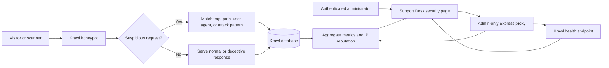
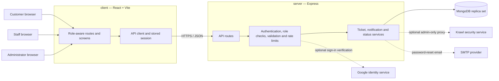
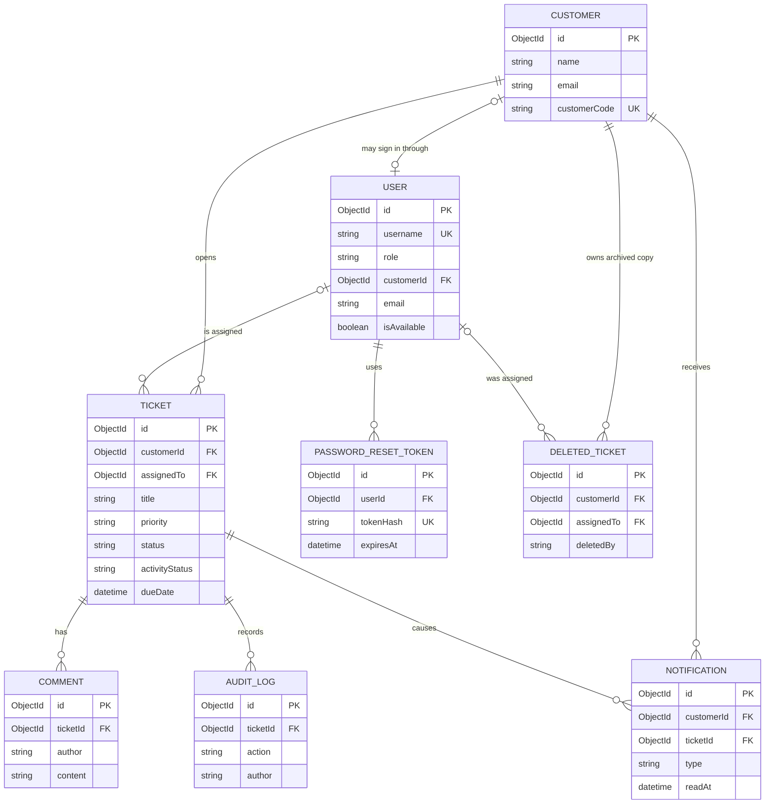
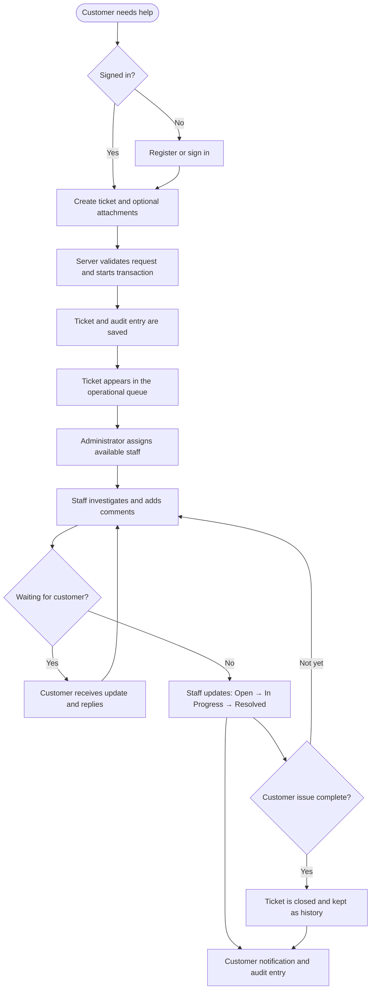
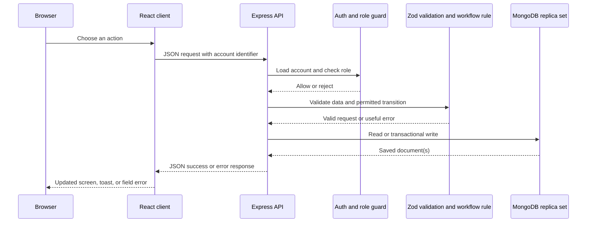
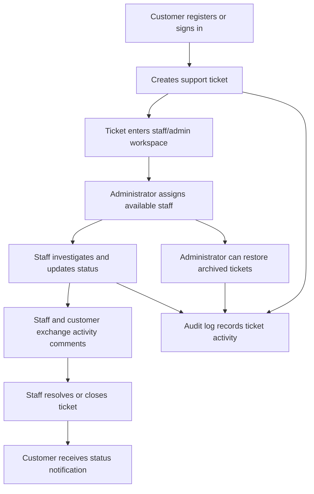

# Support Ops Desk

Support Ops Desk is an internal service-ticket management application used by customers, support staff, and administrators. It manages ticket intake, assignment, customer communication, lifecycle tracking, audit history, notifications, attachments, and recoverable deletion on a React, Express, and MongoDB stack.

**Author:** Aashish A. Shirahatti, 3rd-year CSE-AIML student at VVCE, Mysore.

**Live demo:** `https://render-desk.onrender.com`<br>
**Default testing administrator:** `Username: admin`, `Password: admin@2026`.<br>
For Render testing, set `ADMIN_PASSWORD=admin@2026`. Change this password before
using the application with real users or production data.<br>
Staff accounts are created by an administrator from staff management. Customer
accounts are created from the customer registration page. Staff and customer
passwords are not seeded or hardcoded in the repository.
**During local development, run `npm run seed` after connecting the database to
generate tickets, customers, comments, and audit records.**
**Demo health check:** `https://render-desk.onrender.com/api/health/db`

## 1.README

### Project layout

```text
support-ops-desk/
├── client/                 # React + Vite application
│   ├── public/
│   ├── src/
│   └── package.json
├── server/                 # Express + MongoDB application
│   ├── src/
│   ├── routes/
│   ├── controllers/
│   ├── models/
│   └── package.json
├── package.json            # npm workspaces commands
└── README.md
```

Run the full application from the repository root with `npm run dev`. Use
`npm run dev:client` when only the Vite client is needed. The production server
serves the built `client/dist` directory, so the deployed app remains a single
web service. The server workspace explicitly loads the repository-root `.env`
when running `npm run dev`, `npm run start`, or `npm run seed`.
When the local development port is already in use (for example, by Docker),
`npm run dev` automatically starts on the next port and prints its URL.

### Prerequisites

- Node.js `>= 22.x` for local development. The production image uses Node.js `24`.
- npm compatible with the selected Node.js version.
- MongoDB `7.x` or Docker Desktop with Compose v2.
- Modern browser: Chrome, Edge, Safari, or Firefox.
- Repository access and local permission to run Docker containers.
- No corporate VPN, IAM role, Kubernetes CLI, or cloud credential is required by the current repository. Production access must be supplied by the deployment owner.

### Local setup

```bash
git clone https://github.com/Ash12106/Render-desk.git
cd Render-desk
cp .env.example .env
npm install
npm run dev
```

Start MongoDB locally before `npm run dev`, or use the Docker setup:

```bash
docker compose up --build -d
docker compose ps
curl -fsS http://localhost:3000/api/health/db
```

### Running the development server alongside Docker

The Compose application publishes port `3000`. If it is already running, the
workspace development server automatically uses `3001` instead of exiting. The
terminal prints the selected URL; open that URL for the workspace version.

```text
Port 3000 is already in use. Starting the development server on 3001 instead.
Server running on http://localhost:3001
```

Use `PORT=3002 npm run dev` to choose a different port explicitly. Set
`PORT_FALLBACK_DISABLED=true` only when an occupied port should be treated as
an error. The Docker service remains available on its published port.

Expected local URLs:

- Staff/admin login: `http://localhost:3000/`
- Customer login and registration: `http://localhost:3000/customer/login`
- Database readiness: `http://localhost:3000/api/health/db`
- Swagger UI: `http://localhost:3000/api-docs`

When the development server falls back to `3001`, replace `3000` with `3001`
in the URLs above.

Krawl security monitoring is available only inside the authenticated administrator
workspace at `http://localhost:3000/security`. Krawl is not published on a separate
host port; the Express server reaches it privately at `http://krawl:5000` through
Docker Compose. Krawl metrics, attacks, IPs, honeypot records, credentials, and
paths are read from Krawl's connected database endpoints. The app does not create
fallback or guessed security data. Staff and customer accounts receive a forbidden
response from every Krawl API route.

When port `3000` is already used by another local project, start this Compose app
with `PORT=3001 docker compose up --build -d app` and use
`http://localhost:3001/security`. Krawl remains private to the Compose network on
container port `5000`; it is never published as a separate host service.

### Krawl honeypot

Krawl is a deception and threat-monitoring service integrated into the Support Desk.
It presents believable decoy pages and traps to scanners and suspicious clients,
records request metadata in its own database, and exposes aggregated security data
through its authenticated dashboard API. The Support Desk does not invent threat
records or replace unavailable values with fake data.

#### Krawl request flow



Requests are handled by Krawl first. Suspicious paths, scanner-like user agents,
and attack patterns are recorded in Krawl's database. The Support Desk never reads
or invents Krawl data directly; it requests health and persisted metrics through
the admin-only proxy and displays the response to administrators.

#### Krawl features

- **Deception traps:** configured paths such as `/admin`, `/wp-admin`,
  `/phpmyadmin`, `/.env`, `/.aws/credentials`, and `/config.php` respond as decoy
  resources and can be classified as honeypot activity.
- **Suspicious request detection:** Krawl evaluates request paths, methods,
  payload patterns, and scanner-like user agents.
- **Threat records:** access logs, attack classifications, honeypot hits, IP
  reputation, captured credential attempts, top paths, and top user agents are
  stored in Krawl's database when the Krawl persistence configuration is enabled.
- **Tarpit behavior:** configurable response delays and noise slow automated
  probing without affecting the Support Desk application.
- **IP analysis:** Krawl tracks suspicious IP activity and reputation categories.
- **Admin monitoring:** the Support Desk security page displays health, metrics,
  recent attacks, and IP data through the app's admin-only proxy.
- **Staff Google linking:** staff sign in once with the temporary username and
  password created by an administrator, open their profile, and link a verified
  Google account. Future staff sign-ins can use that linked Google account.

#### How to use Krawl locally

1. Copy `.env.example` to `.env` and set `ADMIN_PASSWORD` and
   `KRAWL_DASHBOARD_PASSWORD` to local secrets.
2. Start the stack:

   ```bash
   docker compose up --build -d
   ```

3. Confirm Krawl is healthy:

   ```bash
   docker compose ps
   docker compose logs --tail=50 krawl
   ```

4. Open `http://localhost:3000/`, sign in with an administrator account, and
   select **Security**, or open `http://localhost:3000/security` directly.
  Staff can open **Profile** after their first password sign-in and use **Link
  Google account** before signing out.
5. To generate a harmless local probe for testing, request one configured trap:

   ```bash
  docker compose exec -T krawl python -c "import urllib.request; request=urllib.request.Request('http://127.0.0.1:5000/admin', headers={'User-Agent':'security-test-client'}); print(urllib.request.urlopen(request).status)"
   ```

   The Support Desk does not expose Krawl directly; the Krawl container is
   reachable only inside the Compose network at `http://krawl:5000`.

#### How to use Krawl on Render

Deploy Krawl as a separate service and set the Support Desk Render variables:

```text
KRAWL_API_URL=https://your-krawl-service.onrender.com
KRAWL_DASHBOARD_PASSWORD=<the same Krawl password>
KRAWL_DASHBOARD_SECRET_PATH=/security-dashboard-secret
```

Check the Krawl service before redeploying Support Desk:

```bash
curl https://your-krawl-service.onrender.com/security-dashboard-secret/healthz
```

The expected response is `{"status":"ok"}`. Then open
`https://render-desk.onrender.com/security` as an administrator. Staff and
customer accounts receive `403` from the Krawl proxy routes.

If the Support Desk shows **Krawl endpoint not found**, first visit the Krawl
service root once in a browser to wake a free Render service:

```text
https://your-krawl-service.onrender.com/
```

Wait for the Krawl page to load, then retry this health URL:

```text
https://your-krawl-service.onrender.com/security-dashboard-secret/healthz
```

If the health URL still fails, check the Krawl service logs. The startup log must
say `DASHBOARD AVAILABLE AT /security-dashboard-secret`. If it shows a random path,
the service was deployed from **Existing Image** instead of this repository's
`Dockerfile.krawl`; recreate or redeploy the Krawl service using that Dockerfile.
The local Compose service is pinned to Krawl `v2.3.1` so local and Render behavior
remain aligned.

Krawl's standalone SQLite data requires persistent storage for durable history.
Free hosting services may restart or sleep services and discard local SQLite data;
use persistent storage or an external database when retaining threat history is
important.

### quick test

```bash
# Start the complete local stack
docker compose up --build -d

# Confirm containers and database readiness
docker compose ps
curl -fsS http://localhost:3000/api/health/db

# Generate sample customers, tickets, audit logs, and comments
npm run seed
```

Then open `http://localhost:3000/` and use the admin account configured by
`ADMIN_PASSWORD` from the untracked `.env` file. From the admin workspace, create
a staff account and assign a generated ticket. Open
`http://localhost:3000/customer/login` in a private window to register a
customer, create a ticket, and test the shared activity flow.

The seed command creates customer profiles and ticket data; it does not create
customer login accounts. Customer accounts must be registered through the
customer login screen or API.

### Password reset

Staff and customers can select **Forgot password?**, enter their registered email
address, and receive a one-hour reset link. Tokens are stored hashed in MongoDB,
expire automatically, and are deleted after a successful reset. The response does
not reveal whether an email exists.

Configure SMTP before using the feature:

```env
APP_BASE_URL=https://render-desk.onrender.com
SMTP_HOST=smtp.example.com
SMTP_PORT=587
SMTP_SECURE=false
SMTP_USER=your-smtp-user
SMTP_PASSWORD=your-smtp-password
SMTP_FROM=support@example.com
```

For local development, set `APP_BASE_URL=http://localhost:3000`. If SMTP is not
configured, the request returns a configuration error and no reset email is
claimed to have been sent.

### Environment variables

Copy `.env.example` to `.env`. Use placeholders or a secret manager for shared environments; never commit real credentials.

| Variable                | Description                                       | Example                                 | Required                     |
| ----------------------- | ------------------------------------------------- | --------------------------------------- | ---------------------------- |
| `MONGO_URI`             | Preferred MongoDB connection string               | `mongodb://localhost:27017/support-ops` | Yes for local Node execution |
| `MONGODB_URI`           | Backwards-compatible MongoDB variable             | Empty                                   | No                           |
| `PORT`                  | HTTP port                                         | `3000`                                  | No                           |
| `CORS_ORIGIN`           | Allowed browser origin                            | `http://localhost:3000`                 | Yes for shared/prod use      |
| `ADMIN_PASSWORD`        | Startup-created admin password                    | `change-me-locally`                     | Yes; change before sharing   |
| `GOOGLE_CLIENT_ID`      | Backend Google ID-token audience                  | Empty                                   | No                           |
| `VITE_GOOGLE_CLIENT_ID` | Frontend Google OAuth client ID; build-time value | Empty                                   | No                           |
| `KRAWL_API_URL`         | Private Krawl service URL                         | `http://krawl:5000`                     | Required for Krawl           |
| `KRAWL_DASHBOARD_PASSWORD` | Krawl dashboard service password              | Secret                                  | Required for Krawl           |
| `KRAWL_DASHBOARD_SECRET_PATH` | Krawl dashboard secret path                 | `/security-dashboard-secret`            | Required for Krawl           |
| `NODE_ENV`              | Runtime mode                                      | `development` or `production`           | No                           |

For local Google sign-in, use the same Google OAuth client ID for `GOOGLE_CLIENT_ID` and
`VITE_GOOGLE_CLIENT_ID`. In Google Cloud Console, add `http://localhost:3000` under
**Authorized JavaScript origins** for that client. Staff and admin accounts must already
exist with the same Google account email; customer Google sign-in can create or link a
customer account automatically.

## System design

This is deliberately a straightforward two-part application: one React client
for people using the desk and one Express server that owns the business rules
and data. Keeping those responsibilities separate means a screen can change
without bypassing access checks, and a database change is made in one place
instead of being scattered through the UI.

### Architecture overview



The production server serves the built client files and the API from the same
public origin. Locally, Vite is attached as Express middleware so the browser
still talks to a single application address.

### Client design

The `client/` workspace is the user-facing React application.

| Area | Responsibility | Why it lives here |
| --- | --- | --- |
| `client/src/routes/` | Login, dashboards, ticket detail, customer portal, profiles, and staff management screens | Routes describe what each type of user can see and do. |
| `client/src/components/` | Shared layouts, forms, badges, dialogs, toast messages, and the admin security dashboard | Reusable UI keeps interaction and visual behavior consistent. |
| `client/src/api/index.ts` | Adds the current account identifier and turns API failures into useful UI errors | Screens should not each need to understand request details. |
| `client/src/lib/` | Session storage, Google configuration, formatting, and small shared helpers | Browser-specific concerns stay out of feature screens. |
| `client/src/hooks/` | Query hooks for security-monitoring views | Remote-data behaviour is kept close to the feature that uses it. |

The client never decides whether someone is allowed to update a ticket. It
only presents the actions that make sense for the signed-in role; the server
always enforces the real permission.

### Server design

The `server/` workspace is the source of truth for permissions, workflows, and
data changes.

| Area | Responsibility | Examples |
| --- | --- | --- |
| `server/src/index.ts` | Builds Express, mounts middleware and routes, serves the client, starts migrations | CORS, Helmet, rate limiting, Swagger, health endpoint |
| `server/routes/` | Keeps feature-specific HTTP route handling separate | Admin-only Krawl proxy |
| `server/controllers/` | Holds business rules that should not depend on HTTP | Allowed ticket status transitions |
| `server/models/` | Defines Mongoose schemas, indexes, migrations, and transactions | Users, tickets, audit records, notifications |
| `server/src/notifications.ts` | Records and simulates customer status-change notifications | A ticket update creates a traceable notification |
| `server/src/*.test.ts` | Tests API contracts, error conditions, data setup, and integrations | Database configuration and lifecycle rules |

Every write is validated with Zod before it reaches MongoDB. Related writes
such as ticket creation, status updates, archival, and restoration are grouped
in MongoDB transactions; that is why the local database must run as a replica
set.

### Database design

MongoDB stores documents, but the application treats their references as clear
relationships. `Ticket` is the centre of the model: it connects the customer
who needs help, the staff member assigned to help, and the timeline of what
happened.



`DeletedTicket` is a recoverable archive, not an active ticket. When an
administrator deletes a ticket, the app archives the ticket and its related
history inside a transaction. Restoring reverses that process so a mistaken
deletion does not silently destroy support history. Password-reset tokens store
only a hash and expire automatically.

### User design and permissions

The application has three human-facing roles. They share the same ticket data,
but each sees only the tools needed for their job.

| User | What they need | What the application lets them do |
| --- | --- | --- |
| **Customer** | A simple place to ask for help and follow progress | Register or sign in, create tickets, attach files, add comments, view their own ticket history and notifications, and maintain their profile. |
| **Support staff** | A focused queue that shows assigned work | View assigned tickets, update supported lifecycle states and activity state, add comments, inspect customer context, download attachments, and set availability. |
| **Administrator** | Oversight without doing staff work on their behalf | Create and manage staff, roles, teams, and branches; inspect workload; assign or restore tickets; and view the security dashboard. |

Authentication identifies the account, while role middleware on the API decides
whether the requested operation is permitted. For example, a customer cannot
read another customer's ticket and a staff member cannot use the administrator
security endpoints simply by navigating to their URL.

### Support workflow



Status transitions are intentionally limited: a closed ticket cannot be
reopened through the normal workflow. This keeps lifecycle reporting honest and
prevents an accidental update from rewriting completed work.

### Operational request flow

This is the path followed by a normal browser request. It makes explicit where
the app rejects bad input before a database write can occur.



Core modules:

- `client/src/`: React routes, dashboards, customer portal, ticket forms, profiles, and shared UI.
- `client/src/api/index.ts`: browser API client.
- `server/src/index.ts`: Express API, middleware, Swagger, static frontend serving, and startup migrations.
- `server/models/mongo.ts`: MongoDB connection, schemas, migrations, and transactions.
- `server/src/notifications.ts`: customer notification records.
- `server/controllers/ticketStatusController.ts`: ticket lifecycle transition rules.
- `server/src/*.test.ts` and `client/src/routes/TicketsDashboard.test.tsx`: API, notification, status, and dashboard tests.
- `Dockerfile` and `docker-compose.yml`: production image and MongoDB replica-set deployment.

### Application features by stakeholder

| Stakeholder               | Main features                                                                                                                                                                              | Value delivered                                                                     |
| ------------------------- | ------------------------------------------------------------------------------------------------------------------------------------------------------------------------------------------ | ----------------------------------------------------------------------------------- |
| **Customer**              | Register and sign in, create support tickets, view ticket status, read notifications, exchange comments, manage profile, and use Google sign-in when configured.                           | A self-service support channel with transparent progress and conversation history.  |
| **Support staff**         | View assigned work, search and filter tickets, update lifecycle and activity status, comment, inspect customer context, download attachments, and publish availability.                    | A focused workspace for resolving assigned requests and keeping customers informed. |
| **Administrator**         | Create staff/admin accounts, manage roles, teams, branches and profile details, review workload metrics, assign tickets to available staff, bulk-assign work, and restore deleted tickets. | Operational control, workload balancing, and recoverability.                        |
| **Application/API**       | Role-based authorization, Zod validation, rate limiting, Helmet security headers, transactional writes, audit logs, notifications, health checks, and Swagger documentation.               | Consistent, observable, and safer service behavior.                                 |
| **Developer** | Docker Compose startup, database seed script, automated tests, formatting/lint checks, health endpoint, API documentation, and repeatable smoke-test commands.                             | Fast reproduction .                                    |

### End-to-end stakeholder flow



### Feature demonstration order

1. Start Docker and run `npm run seed` to populate tickets, customers, comments, and audit records.
2. Sign in as the default administrator and create a staff account.
3. Assign a generated ticket to the staff member and update its lifecycle.
4. Register a customer in a private browser window and create a customer ticket.
5. Exchange comments between customer and staff and verify the activity log.
6. Close a ticket, verify it becomes read-only, then test administrator deletion and restoration.

### Testing and quality checks

Run these commands before a pull request:

```bash
npm run lint
npm run lint:eslint
npm run format:check
npm test
npm run build
npm audit
```

The verified local suite contains 11 passing test files and 55 passing tests, with
24 intentionally skipped tests. `npm run lint`, `npm run lint:eslint`, and
`npm run format:check` pass. The build may emit a non-blocking Vite warning when
the main browser bundle exceeds 500 kB.

### Verification report

The application was tested against the connected MongoDB database using the
documented administrator account and temporary uniquely prefixed staff and
customer accounts. The workflow verified administrator login and staff creation,
customer registration and login, customer ticket creation, customer comments,
administrator assignment, staff ticket visibility, staff comments, database
health, Krawl health, Krawl statistics, and staff denial of Krawl access (`403`).
Temporary accounts and all related tickets, comments, audit records, and customer
records were deleted after testing. No pre-existing user records were deleted.

### Deployment and CI/CD

The repository currently has no `.github/workflows` CI/CD pipeline. The supported deployment path is a manual Docker Compose release:

```bash
npm run lint
npm run lint:eslint
npm run format:check
npm test
npm run build
docker compose up --build -d
docker compose ps
curl -fsS http://localhost:3000/api/health/db
```

The Docker image builds the frontend and bundled server with Node.js 24 Alpine. The runtime serves `server/dist/index.cjs` and the built `client/dist` files on port `3000`. MongoDB 7 runs as a single-node replica set with the persistent `mongo_data` volume. Before public exposure, add HTTPS, a reverse proxy or managed platform, restricted `CORS_ORIGIN`, and deployment-secret injection.

### Render deployment

- **Render application URL:** `https://render-desk.onrender.com`
- **Health endpoint:** `https://render-desk.onrender.com/api/health/db`
- **Swagger URL:** `https://render-desk.onrender.com/api-docs`
- **Render service name:** `support-ops-desk`

Required Render variables are `MONGO_URI`, `CORS_ORIGIN`,
`ADMIN_PASSWORD`, `GOOGLE_CLIENT_ID`, `KRAWL_API_URL`,
`KRAWL_DASHBOARD_PASSWORD`, `KRAWL_DASHBOARD_SECRET_PATH`, and
`APP_BASE_URL`, `SMTP_HOST`, `SMTP_PORT`, `SMTP_SECURE`, `SMTP_USER`,
`SMTP_PASSWORD`, `SMTP_FROM`, and `NODE_ENV=production`. Use
`https://render-desk.onrender.com` as the production
`CORS_ORIGIN`. Keep database credentials, OAuth values, and Krawl passwords in
Render's environment settings, not in this file.

Do not set `PORT` manually on Render; Render provides the port to the container.

Render does not run this repository's Docker Compose stack. Deploy Krawl as a
second Render web service from this same GitHub repository using `Dockerfile.krawl`
and port `5000`, or use a managed Krawl deployment. The repository Dockerfile
copies `krawl-config.yaml` into the image so the dashboard path stays
`/security-dashboard-secret` instead of changing randomly on restart. Then set
`KRAWL_API_URL` to the deployed Krawl service URL. Do not expose Krawl's dashboard
directly to the public internet. The Support Desk proxies Krawl data only through
the admin-authenticated `/api/admin/krawl/*` routes.

`KRAWL_API_URL` must be the Krawl service URL, for example
`https://krawl-service.example.com`; do not set it to
`https://render-desk.onrender.com`. The proxy also accepts the Krawl service URL
with `/security-dashboard-secret` appended, but the separate
`KRAWL_DASHBOARD_SECRET_PATH` value must remain `/security-dashboard-secret`.

`GOOGLE_CLIENT_ID` is read by the server at runtime. The frontend reads the
public client ID from `/api/auth/config`, so Docker does not need a
`VITE_GOOGLE_CLIENT_ID` build argument. Keeping `VITE_GOOGLE_CLIENT_ID` set is
still supported for local or static frontend builds.

For Google sign-in, add both `http://localhost:3000` and
`https://render-desk.onrender.com` under the OAuth client's **Authorized JavaScript
origins** in Google Cloud Console. `GOOGLE_CLIENT_ID` and
`VITE_GOOGLE_CLIENT_ID` must contain the same client ID. The production server
allows Google Identity Services through its Content Security Policy.

### Ownership and support

The repository does not currently define formal ownership or an on-call rotation.
- **Production URL:** `https://render-desk.onrender.com`

---

## 2. Architecture Decision Record: MongoDB Replica Set

- **Status:** Accepted for the current web application
- **Date:** 09/09/2026
- **Decision owner:** Aashish.A.Shirahatti

### Context

The application creates related records across users, customers, tickets, comments, notifications, audit logs, and the deleted-ticket archive. Registration, ticket creation, deletion, and restoration require atomic multi-document writes. A standalone MongoDB process does not provide the transaction topology required by these workflows, while the application must remain simple to run locally and in Docker.

### Decision

Used MongoDB 7 configured as a single-node replica set for local and Compose-based deployments. Mongoose provides schema and connection management, while the application uses transactions for multi-document operations. Docker Compose starts MongoDB with `--replSet rs0` and runs a one-shot initializer before the app container starts.

### Rationale

- Supports the existing transactional write model without introducing a second database system.
- Preserves a simple document model for tickets, comments, audit records, notifications, and customer profiles.
- Matches MongoDB Atlas replica-set behavior closely enough for development and integration testing.
- Keeps local onboarding reproducible with one Compose command.

### Consequences

**Benefits**

- Atomic registration, ticket, archive, and restore workflows.
- Natural document representation for variable ticket fields and attachments.
- Persistent local data through the `mongo_data` Docker volume.
- Clear health and initialization checks.

**Costs and risks**

- Local MongoDB setup is more complex than a standalone process.
- A single-node replica set is not high availability; production must use an appropriately sized managed or clustered deployment.
- Transaction behavior depends on correct session handling and replica-set readiness.
- MongoDB connection, storage, and transaction metrics require operational monitoring.

**Revisit when:** production scale, multi-region recovery, reporting workloads, or retention requirements exceed the current single-node/document-store design.

---

## 3. API Contract Overview: Customer Registration

### Endpoint

`POST /api/customer-auth/register`

Creates a customer profile and customer user account in one MongoDB transaction.

### Authentication

Public endpoint. No bearer token is required.

### Request headers

```http
Content-Type: application/json
```

### Request payload

```json
{
  "name": "Asha Patel",
  "email": "asha.patel@example.com",
  "username": "asha.patel",
  "password": "replace-with-a-local-password"
}
```

Validation rules:

- `name`: trimmed string, minimum 2 characters.
- `email`: valid email address; stored in lowercase.
- `username`: trimmed string, 3 to 40 characters.
- `password`: minimum 8 characters; stored only as a bcrypt hash.

### Success response: `201 Created`

The response contains the newly created user document. The exact MongoDB-generated `_id` values can vary by environment; sensitive password material is not returned.

```json
{
  "_id": "65f000000000000000000001",
  "username": "asha.patel",
  "role": "customer",
  "customerId": "65f000000000000000000002"
}
```

### Error responses

| Status | Condition                        | Response shape                                                                                        |
| ------ | -------------------------------- | ----------------------------------------------------------------------------------------------------- |
| `400`  | Invalid payload                  | `{ "success": false, "message": "Validation failed", "fields": {}, "data": null }`                    |
| `409`  | Username or email already exists | `{ "success": false, "message": "...", "data": null }`                                                |
| `503`  | MongoDB unavailable              | `{ "success": false, "message": "Service temporarily unavailable (database offline)", "data": null }` |
| `500`  | Unexpected server failure        | `{ "success": false, "message": "Unexpected server failure", "data": null }`                          |

### Example

```bash
curl -X POST http://localhost:3000/api/customer-auth/register \
  -H 'Content-Type: application/json' \
  -d '{
    "name": "Asha Patel",
    "email": "asha.patel@example.com",
    "username": "asha.patel",
    "password": "local-password-123"
  }'
```

---

## 4. Developer Onboarding and Troubleshooting Guide

### checklist

1. Install Node.js 22+ and Docker Desktop with Compose v2.
2. Clone the repository and copy `.env.example` to `.env`.
3. Start the stack with `docker compose up --build -d`.
4. Verify `docker compose ps` and `/api/health/db`.
5. Run `npm test`, `npm run lint`, and `npm run lint:eslint`.
6. Review `SUPPORT_DESK_GUIDE.md` and `/api-docs`.

### Generate local mock data

The seed command creates up to 12 customer profiles, up to 50 tickets, audit
records for generated tickets, and comments for the first 10 generated tickets.
It does not delete existing data, skips ticket generation when 50 tickets
already exist, and does not create customer login accounts.

```bash
npm run seed
```

For a clean Docker database reset, use this only when existing local data can be discarded:

```bash
docker compose down -v
docker compose up --build -d
npm run seed
```

### Common setup errors

#### Error 1: `npm ci` reports a lockfile mismatch or an unsupported Node engine

**Cause:** The dependency lockfile and `package.json` are not synchronized, or Node.js is below the supported version.

**Resolution:**

```bash
node --version
npm --version
npm install
npm run lint
```

Use Node.js 22 or newer. Docker uses Node.js 24 and installs from the committed lockfile.

#### Error 2: `mongo-init` exits or the app reports database unavailable

**Cause:** MongoDB has not finished starting, the replica set was not initialized, or an old Docker volume contains an invalid local state.

**Resolution:**

```bash
docker compose ps -a
docker compose logs mongo mongo-init
docker compose down -v
docker compose up --build -d
curl -fsS http://localhost:3000/api/health/db
```

The `-v` flag deletes local database data; do not use it for shared or valuable environments.

### Git workflow standard

The repository does not currently enforce a branch or commit policy in CI. The following convention is recommended for pull requests:

- Branches: `feature/<short-description>`, `fix/<short-description>`, `docs/<short-description>`, `chore/<short-description>`.
- Examples: `feature/customer-ticket-export`, `fix/mongo-health-check`, `docs/api-contract`.
- Commits: Conventional Commits format: `<type>: <imperative summary>`.
- Allowed common types: `feat`, `fix`, `docs`, `test`, `refactor`, `chore`, `build`, `ci`.
- Examples: `feat: add customer ticket notifications`, `fix: handle replica set startup`, `docs: add registration contract`.
- Pull requests should include scope, validation commands, configuration changes, migration impact,Google Auth and rollback notes.

### Handy test commands

```bash
# Public readiness and documentation
curl -i http://localhost:3000/api/health/db
open http://localhost:3000/api-docs

# Expected authentication protection on a private route
curl -i http://localhost:3000/api/tickets

# Register a disposable customer account
curl -X POST http://localhost:3000/api/customer-auth/register \
  -H 'Content-Type: application/json' \
  -d '{"name":"Demo Customer","email":"demo@example.com","username":"demo.customer","password":"demo-password-123"}'

# Useful operational checks
docker compose ps -a
docker compose logs --tail=100 app mongo
docker stats --no-stream
```

Expected results: the health endpoint returns `200`, the unauthenticated
ticket request returns `401`, and customer registration returns `201` unless
the sample username or email already exists.

---

## 5. SRE / Operational Runbook

### Service profile

- **Service:** Support Ops Desk web application and API
- **Primary dependency:** MongoDB 7 replica set
- **Health endpoint:** `GET /api/health/db`
- **Readiness success:** HTTP `200`, JSON `status: "ok"`, and `database.connected: true`
- **Degraded database response:** HTTP `503`, JSON `status: "degraded"`
- **Default application port:** `3000`

### Proposed SLOs

These are proposed operational targets; the repository does not currently publish measured production SLOs.

| Indicator            | Target                                                  | Measurement                                            |
| -------------------- | ------------------------------------------------------- | ------------------------------------------------------ |
| Availability         | `99.9%` monthly for the app and health endpoint         | Successful HTTP requests excluding planned maintenance |
| API latency          | `p95 < 500 ms`, `p99 < 1 s` for non-upload API requests | Server request-duration histogram                      |
| Health-check latency | `p95 < 250 ms`                                          | `/api/health/db` request duration                      |
| Error rate           | `< 1%` 5xx responses over 5 minutes                     | Application HTTP metrics                               |
| Recovery objective   | Restore service within `30 minutes`                     | Incident start to healthy endpoint                     |
| Data recovery        | RPO `<= 15 minutes` in production                       | MongoDB backup policy; not provided by local Compose   |

### Metrics and logs to monitor

**Application**

- HTTP request count by method, route, status, and role.
- 4xx and 5xx rate, especially `5xx` by route.
- Request latency p50/p95/p99.
- Node.js process uptime, event-loop lag, CPU, RSS heap, and container restarts.
- Rate-limit responses and authentication failures.
- Upload payload rejection and request-body size errors.

**MongoDB**

- Connection state and pool utilization.
- Query latency, operation count, and slow queries.
- Transaction aborts, write conflicts, and buffering timeouts.
- WiredTiger cache pressure, disk utilization, and replication/replica-set state.
- Database health endpoint status and ping latency.

**Platform**

- Container CPU, memory, filesystem, and restart count.
- Host disk capacity for `mongo_data`.
- Network errors, load-balancer health, and TLS/reverse-proxy errors.
- Backup success, restore test status, and secret rotation status.

### High 5xx error rate playbook

1. **Confirm the alert and scope.** Check whether the increase affects all routes or one route, whether it is limited to one role, and whether latency or container restarts increased at the same time.

2. **Check service and database readiness.**

   ```bash
   docker compose ps
   curl -i http://localhost:3000/api/health/db
   docker compose logs --tail=200 app mongo
   ```

   A `503` or `database.connected: false` points to MongoDB readiness, connectivity, or replica-set failure rather than an application route defect.

3. **Check recent application errors.** Look for `MongoNetworkError`, buffering timeouts, transaction aborts, validation failures, uncaught exceptions, and repeated route-specific stack traces. Do not expose raw logs or credentials in incident channels.

4. **Check MongoDB state.**

   ```bash
   docker compose exec mongo mongosh --quiet --eval 'rs.status()'
   docker compose exec mongo mongosh --quiet --eval 'db.adminCommand({ ping: 1 })'
   ```

   Confirm the replica set is initialized, the member is primary/healthy, disk is available, and connection limits are not exhausted.

5. **Check container resources and restarts.**

   ```bash
   docker stats --no-stream
   docker compose ps -a
   ```

   If the app is restarting or memory constrained, preserve logs, record the container state, and scale or restart according to the deployment platform procedure.

6. **Reproduce with low-risk requests.** Test the health endpoint, Swagger page, and a protected route without credentials. Avoid mutation requests until database health and error scope are understood.

7. **Mitigate.** Depending on evidence, remove a bad deployment, roll back to the last known-good image, restore database connectivity, or route traffic to a healthy instance. Do not run `docker compose down -v` in production; it deletes the local database volume.

8. **Validate recovery.** Confirm 5xx rate returns below the SLO threshold, `/api/health/db` returns HTTP `200`, containers remain stable, and representative authenticated read/write workflows succeed.

9. **Close out.** Record timeline, impact, root cause, mitigation, data integrity outcome, and follow-up actions. Add a regression test or monitoring rule for the failure mode.

### Rollback guardrails

- Preserve the current image, logs, and deployment metadata before rollback.
- Confirm schema and migration compatibility before moving to an older application image.
- Take or verify a database backup before destructive recovery operations.
- Treat `docker compose down -v` as a local reset command only.
- Rotate credentials if logs, tokens, or environment values were exposed.
